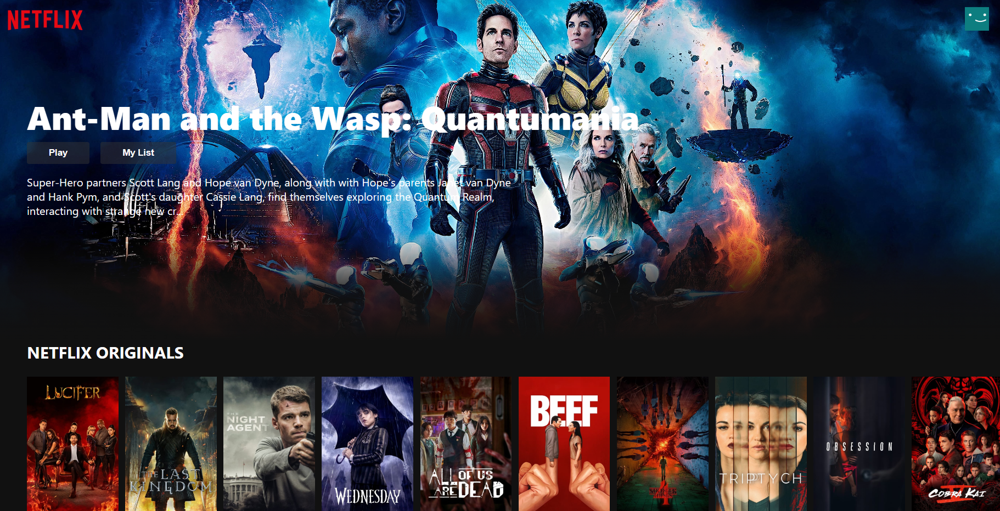
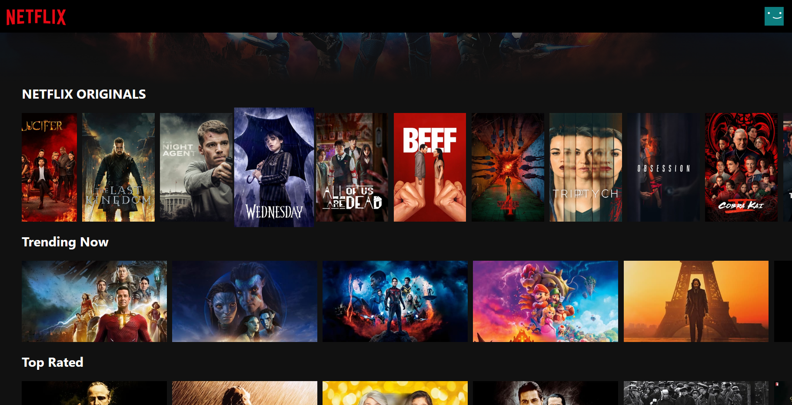
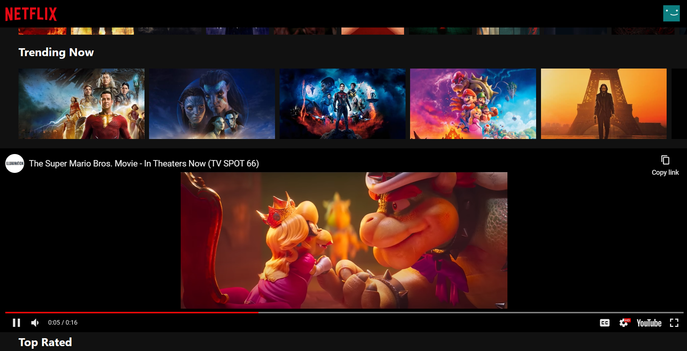

# Netflix Clone in React

This is a React project that uses Firebase for real-time database storage. The user can interact with the movie cards and play their trailer in this project. The movies that are shown are constantly changing with time.

## Table of contents

-   [Overview](#overview)
    -   [The challenge](#the-challenge)
    -   [Screenshot](#screenshot)
    -   [Links](#links)
-   [My process](#my-process)
    -   [Built with](#built-with)
    -   [What I learned](#what-i-learned)
    -   [Continued development](#continued-development)
    -   [Useful resources](#useful-resources)
-   [Author](#author)

## Overview

### The Theme

Users should be able to:

-   View the whole page as shown on the Netflix website.
-   See hover states for all interactive elements on the page.
-   Play the trailer when the image card is clicked and stop the trailer when again clicked on the image.

### Screenshot

| Main Page                                                           |
| ------------------------------------------------------------------- |
|  |

| Hover State                                                             | Clicked State                                                                |
| ----------------------------------------------------------------------- | ---------------------------------------------------------------------------- |
|  |  |

### Links

-   [Github Solution](https://github.com/ShivamManiMaurya/netflix-clone)
-   [Live Site](https://netflix-clone-ece17.web.app/)

## My process

### Built with

-   HTML5
-   CSS custom properties
-   Flexbox
-   JavaScript
-   [React](https://reactjs.org/) - JS library
-   [Firebase](https://firebase.google.com/) - For database
-   [TMDB_Api](https://developers.themoviedb.org/3/getting-started/introduction) - Movie database Api

### What I learned

-   Setup firebase
-   Introduction to Firebase
-   useEffect hook and its different ways
-   Promises
-   Optional Chaining
-   Get familiar with Async/Await
-   Get familiar with overflow CSS property
-   Get familiar with ::-webkit-scrollbar in CSS
-   Get more familiar with transition and transform CSS property
-   Get more familiar with animations in CSS

### Continued development

After this project, I want to develop a Netflix 2.0 clone in which I want to do development with redux, and next-js and want to add more functionalities like authentication, subscription, payment, and many more.

### Useful resources

-   [Clever Programmer](https://www.youtube.com/channel/UCqrILQNl5Ed9Dz6CGMyvMTQ) - A very special thanks to Clever Programmer
-   [Akshay Saini](https://www.youtube.com/@akshaymarch7) - Akshay Saini bhaiya helped me in understanding promises and other concepts
-   [Sonny Sangha](https://www.youtube.com/@SonnySangha) - A very special thanks to Sonny Sangha as well and also he helped me in understanding useEffect hooks and other concepts as well.

## Author

-   Website - [Shivam Maurya](https://www.your-site.com)
-   GitHub Page - [Shivam Maurya GitHub](https://github.com/ShivamManiMaurya)
-   Linkedin - [@shivammanimaurya](https://www.linkedin.com/in/shivammanimaurya)
